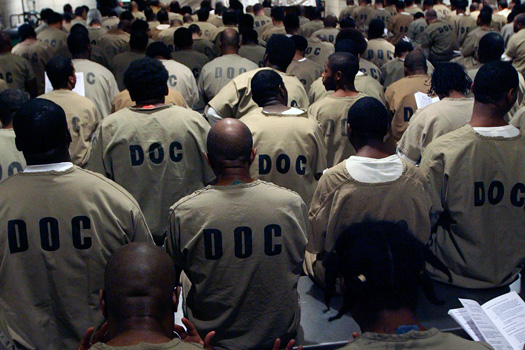

# Racial bias and imprisonment

African Americans are incarcerated at _**five times**_ the rate as whites; this disproportionate relationship between their population percentage and their incarceration rates are a sign of _**racial prejudice**_.

Vince Quach

For more information, click on the following links

 | Source | Description | Author | Link |
 | --- | --- | --- | --- |
 | The Sentencing Project: Working for a Fair and Effective Criminal Justice System | A study of the justice system's prejudice | Ashley Nellis, Ph.D. | [Link](https://www.sentencingproject.org/publications/color-of-justice-racial-and-ethnic-disparity-in-state-prisons/) |
 | NAACP's Criminal Justice Fact Sheet | The statistics that back up the concept of racially biased incarceration | NAACP | [Link](http://www.naacp.org/criminal-justice-fact-sheet/) |
 | "What It's Like to Be Black in the Criminal Justice System" | A brief overview of the racial disparities at every phase of the justice system | Andrew Kahn and Chris Kirk | [Link](http://www.slate.com/articles/news_and_politics/crime/2015/08/racial_disparities_in_the_criminal_justice_system_eight_charts_illustrating.html) |
